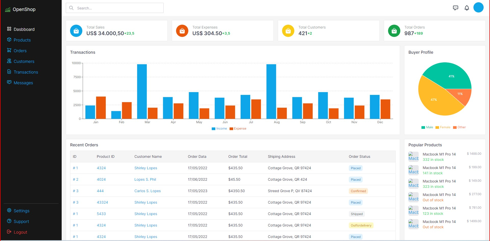

<p aligh="center">

</p>

## How to use this repository:

This README file provides instructions on how to set up and run a React application using Create React App.

**Prerequisites:**

* Node.js installed on your system
* A basic understanding of JavaScript and HTML

**Steps:**

1. **Clone this repo:**

```bash
git clone https://github.com/tvm-dev/Dashboard-Tailwind-ReactJS.git
```

2. **Navigate to the project directory:**

```bash
cd Dashboard-Tailwind-ReactJS
```

3. **Install all packages:**

```bash
npm i
```

4. **Start the development server:**

```bash
npm run start
```

